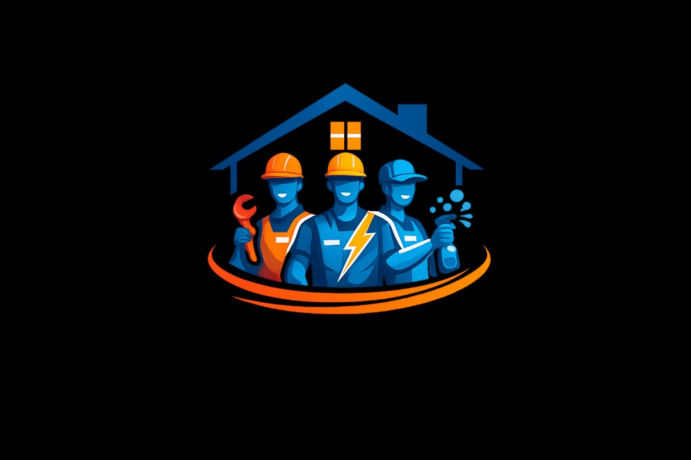

# Easy 2 Work – On-Demand Home Service Platform

<div align="center">



**India's Premier On-Demand Home Service Web Platform**

Book trusted professionals for cleaning, repair, and maintenance services at your doorstep.

[](LICENSE)
[](https://www.java.com)
[](https://jakarta.ee)
[](https://maven.apache.org)
[](https://www.mysql.com)

[Features](#-features) • [Tech Stack](#-technology-stack) • [Installation](#-installation--setup) • [Screenshots](#-screenshots) • [API Docs](#-api-documentation)

</div>

---

## 📖 About

**Easy 2 Work** is a comprehensive web-based on-demand home service platform connecting users with verified professionals for household services including electrical repairs, AC servicing, laundry, and deep cleaning. Built with Java/Jakarta EE, it offers real-time booking management, secure payments, and service tracking.

**Service Area**: Varanasi | **Status**: Active Development | **Version**: 1.0.0

---

## ✨ Features

### For Customers
- 🔍 **Service Discovery** - Browse 8+ service categories
- 🛒 **Easy Booking** - Simple 3-step process: Select → Cart → Pay
- 📍 **Address Management** - Save and manage multiple service addresses
- 📅 **Flexible Scheduling** - Choose preferred date and time slots
- 💳 **Multiple Payment Options** - Cash, UPI, Card, Net Banking
- 📜 **Booking History** - Track all past and upcoming bookings
- ⭐ **Ratings & Reviews** - Rate and review service quality
- 🔐 **Secure Platform** - Safe and encrypted transactions

### For Service Professionals
- 📋 **Job Management** - View and accept job requests
- 📍 **Customer Details** - Access customer location and requirements
- 💰 **Earnings Tracking** - Monitor earnings and completed jobs
- 📅 **Schedule Management** - Manage availability and work schedule

### For Admin
- 👥 **User Management** - Manage customers and service professionals
- 🛠️ **Service Management** - Add, edit, and remove services with pricing
- 📊 **Booking Management** - Monitor and manage all bookings
- 📈 **Analytics Dashboard** - Revenue and performance insights
- 🌍 **Area Management** - Expand to new cities and locations

---

## 🛠 Technology Stack

### Backend Technologies
| Technology | Version | Purpose |
|------------|---------|---------|
| **Java** | 17+ | Core programming language |
| **Maven** | 3.8+ | Build automation and dependency management |
| **Jakarta Servlet** | 5.0+ | Web application framework |
| **Jakarta Server Pages (JSP)** | 3.0+ | Server-side dynamic page generation |
| **JDBC** | 4.3+ | Database connectivity layer |
| **MySQL** | 8.0+ | Relational database management |
| **Jackson/JSON-P** | 2.0+ | JSON processing and REST APIs |
| **Jetty** | 11.0+ | Embedded web server (development) |
| **Log4j** | 2.x | Logging framework |

### Frontend Technologies
| Technology | Purpose |
|------------|---------|
| **HTML5** | Semantic markup and structure |
| **CSS3** | Styling, animations, and responsive design |
| **JavaScript (ES6+)** | Client-side interactivity and logic |
| **Bootstrap 5** | Responsive UI framework and components |
| **jQuery** | DOM manipulation and AJAX requests |
| **Font Awesome** | Icon library |
| **Google Maps API** | Location services and maps |

### Database Schema
- **Users** - Customer and professional accounts
- **Services** - Service catalog with pricing
- **Bookings** - Service booking records
- **Payments** - Transaction history
- **Reviews** - Customer feedback and ratings
- **Addresses** - Customer delivery addresses

### External Integrations
| Service | Purpose |
|---------|---------|
| **Razorpay** | Payment gateway integration |
| **Google Maps API** | Location and address services |
| **SMTP (Gmail)** | Email notifications |
| **SMS Gateway** | SMS notifications |

### DevOps & Tools
- **Git/GitHub** - Version control and code repository
- **Docker** - Containerization (optional)
- **Apache Tomcat** - Production application server
- **Jenkins/GitHub Actions** - CI/CD pipeline
- **SonarQube** - Code quality analysis

---

## 🏗️ System Architecture

```
┌──────────────────────────────────────────────────────────────┐
│                        Client Layer                          │
│                    (Web Browser)                             │
│  HTML5 | CSS3 | JavaScript | Bootstrap | jQuery              │
└──────────────────────────────────────────────────────────────┘
                            ↓ HTTP/HTTPS
┌──────────────────────────────────────────────────────────────┐
│                   Presentation Layer                         │
│                  Jakarta Server Pages (JSP)                  │
│  ┌────────────────────────────────────────────────────┐     │
│  │  index.jsp  │  book.jsp  │  track.jsp             │     │
│  │  login.jsp  │  profile.jsp  │  checkout.jsp       │     │
│  └────────────────────────────────────────────────────┘     │
└──────────────────────────────────────────────────────────────┘
                            ↓
┌──────────────────────────────────────────────────────────────┐
│                   Controller Layer                           │
│                   Jakarta Servlets                           │
│  ┌────────────────────────────────────────────────────┐     │
│  │  UserServlet      │  ServiceServlet                │     │
│  │  BookingServlet   │  PaymentServlet                │     │
│  │  TrackingServlet  │  AdminServlet                  │     │
│  └────────────────────────────────────────────────────┘     │
└──────────────────────────────────────────────────────────────┘
                            ↓
┌──────────────────────────────────────────────────────────────┐
│                   Service Layer                              │
│                   (Business Logic)                           │
│  ┌────────────────────────────────────────────────────┐     │
│  │  UserService      │  BookingService                │     │
│  │  PaymentService   │  NotificationService           │     │
│  └────────────────────────────────────────────────────┘     │
└──────────────────────────────────────────────────────────────┘
                            ↓
┌──────────────────────────────────────────────────────────────┐
│                Data Access Layer (DAO/Repository)            │
│  ┌────────────────────────────────────────────────────┐     │
│  │  UserRepository   │  BookingRepository             │     │
│  │  ServiceRepository│  PaymentRepository             │     │
│  └────────────────────────────────────────────────────┘     │
└──────────────────────────────────────────────────────────────┘
                            ↓ JDBC
┌──────────────────────────────────────────────────────────────┐
│                   Database Layer                             │
│                     MySQL 8.0+                               │
│  ┌────────────────────────────────────────────────────┐     │
│  │  Tables: users, bookings, services, payments,      │     │
│  │  professionals, reviews, addresses, categories     │     │
│  └────────────────────────────────────────────────────┘     │
└──────────────────────────────────────────────────────────────┘

                External Services Integration:
    ┌─────────────┐  ┌─────────────┐  ┌─────────────┐
    │  Razorpay   │  │ Google Maps │  │    SMTP     │
    │  (Payment)  │  │   (Maps)    │  │   (Email)   │
    └─────────────┘  └─────────────┘  └─────────────┘
```

### Architecture Highlights

- **MVC Pattern**: Model-View-Controller architecture for clean separation of concerns
- **Servlet Container**: Jetty (dev) / Tomcat (production) for handling HTTP requests
- **Session Management**: HTTP sessions for user authentication and cart management
- **RESTful APIs**: JSON-based APIs for AJAX operations
- **Responsive Design**: Bootstrap-based mobile-friendly interface
- **Security**: Password hashing, SQL injection prevention, CSRF protection

---

## 📁 Project Structure

```
easy-2-work/
├── backend/                           # Backend Java modules
│   ├── catalog/                       # Service catalog and content
│   │   ├── src/main/resources/
│   │   │   └── services.json         # Service definitions
│   │   └── pom.xml
│   ├── core/                          # Core domain models
│   │   ├── src/main/java/com/easy2work/
│   │   │   ├── model/                # Domain entities
│   │   │   │   ├── User.java
│   │   │   │   ├── Service.java
│   │   │   │   ├── Booking.java
│   │   │   │   └── Payment.java
│   │   │   ├── enums/                # Enumerations
│   │   │   └── rules/                # Business rules
│   │   └── pom.xml
│   └── service/                       # Service layer
│       ├── src/main/java/com/easy2work/
│       │   ├── servlet/              # HTTP servlets
│       │   │   ├── UserServlet.java
│       │   │   ├── ServiceServlet.java
│       │   │   ├── BookingServlet.java
│       │   │   └── PaymentServlet.java
│       │   ├── repository/           # Data access layer
│       │   ├── service/              # Business services
│       │   └── util/                 # Utilities
│       └── pom.xml
├── web-ui/                            # Web application (WAR)
│   ├── src/main/webapp/
│   │   ├── index.jsp                 # Landing page
│   │   ├── book.jsp                  # Service booking
│   │   ├── track.jsp                 # Order tracking
│   │   ├── login.jsp                 # User login
│   │   ├── signup.jsp                # User registration
│   │   ├── profile.jsp               # User profile
│   │   ├── history.jsp               # Booking history
│   │   ├── terms.jsp                 # Terms & conditions
│   │   ├── privacy.jsp               # Privacy policy
│   │   ├── css/
│   │   │   ├── style.css            # Main stylesheet
│   │   │   └── responsive.css       # Responsive design
│   │   ├── js/
│   │   │   ├── main.js              # Core JavaScript
│   │   │   ├── booking.js           # Booking logic
│   │   │   └── payment.js           # Payment integration
│   │   ├── images/                   # Static images
│   │   │   ├── logo.png
│   │   │   └── services/            # Service images
│   │   └── WEB-INF/
│   │       ├── web.xml              # Servlet configuration
│   │       └── lib/                  # JAR dependencies
│   └── pom.xml
├── docs/                              # Documentation
│   ├── api/                          # API documentation
│   ├── database/                     # Database schema
│   │   └── schema.sql
│   ├── screenshots/                  # Application screenshots
│   └── deployment/                   # Deployment guides
├── pom.xml                            # Root Maven reactor POM
├── README.md                          # Project documentation
├── .gitignore
└── LICENSE
```

### Module Description

- **backend/catalog**: Service catalog data, labels, and content management
- **backend/core**: Domain models, entities, and business rules
- **backend/service**: Servlets (controllers), repositories (DAO), and business services
- **web-ui**: Jakarta JSP-based web application with HTML, CSS, JavaScript, and static assets

---

## 🌐 Web Application Pages

### Customer-Facing Pages

| Page | File | Description |
|------|------|-------------|
| **Homepage** | `index.jsp` | Landing page with featured services and call-to-action |
| **Services** | `services.jsp` | Complete catalog of all available services |
| **Service Detail** | `service-detail.jsp` | Individual service information, pricing, and reviews |
| **Booking/Cart** | `book.jsp` | Shopping cart with selected services |
| **Login** | `login.jsp` | User authentication page |
| **Signup** | `signup.jsp` | New user registration |
| **Checkout** | `checkout.jsp` | Address selection, scheduling, and payment |
| **Order Tracking** | `track.jsp` | Real-time order status and tracking |
| **User Profile** | `profile.jsp` | Account settings and personal information |
| **Booking History** | `history.jsp` | Past and upcoming bookings |
| **Terms & Conditions** | `terms.jsp` | Legal terms and conditions |
| **Privacy Policy** | `privacy.jsp` | Privacy policy and data usage |

### Admin Panel Pages

| Page | File | Description |
|------|------|-------------|
| **Admin Dashboard** | `admin/dashboard.jsp` | Overview of bookings, revenue, and analytics |
| **Manage Users** | `admin/users.jsp` | User and professional management |
| **Manage Services** | `admin/services.jsp` | Service catalog management |
| **Manage Bookings** | `admin/bookings.jsp` | Booking and order management |
| **Reports** | `admin/reports.jsp` | Analytics and reporting |

### Professional Panel Pages

| Page | File | Description |
|------|------|-------------|
| **Professional Dashboard** | `professional/dashboard.jsp` | Job requests and earnings overview |
| **Job Requests** | `professional/jobs.jsp` | Available and assigned jobs |
| **Earnings** | `professional/earnings.jsp` | Payment and earnings history |
| **Profile** | `professional/profile.jsp` | Professional profile and settings |

---

## 🔄 User Flow

```
┌─────────────────────────────────────────────────────────────┐
│                   Complete User Journey                     │
└─────────────────────────────────────────────────────────────┘

Homepage → Browse Services → Add to Cart → Login/Signup →
Select Address → Choose Date & Time → Payment → Booking Confirmed →
Professional Assigned → Order Tracking → Service Completed →
Rate & Review
```

### Detailed Flow

**1. Service Discovery** (`index.jsp`, `services.jsp`)
- User lands on homepage
- Browses 8 service categories
- Views service details and pricing

**2. Cart & Selection** (`book.jsp`)
- Adds services to cart
- Reviews selected services
- Adjusts quantities

**3. Authentication** (`login.jsp`, `signup.jsp`)
- New user: Registration with email/phone
- Existing user: Login with credentials
- Session management

**4. Checkout** (`checkout.jsp`)
- Select/add delivery address
- Choose preferred date
- Select time slot
- Add special instructions

**5. Payment** (`checkout.jsp`)
- Choose payment method (Online/Cash)
- Complete payment via Razorpay
- Order confirmation

**6. Confirmation** (`confirmation.jsp`)
- Booking ID generated
- Email/SMS confirmation sent
- View booking details

**7. Tracking** (`track.jsp`)
- Professional assigned
- Real-time status updates
- Contact professional

**8. Completion** (`history.jsp`)
- Service marked complete
- Final bill generated
- Rate and review service

---

## 🚀 Installation & Setup

### Prerequisites

Before you begin, ensure you have the following installed:
- **Java Development Kit (JDK)** 17 or higher
- **Apache Maven** 3.8 or higher
- **MySQL Server** 8.0 or higher
- **Git** for version control
- **IDE** (IntelliJ IDEA, Eclipse, or VS Code recommended)

### Quick Start Guide

**Step 1: Clone the Repository**
```bash
git clone https://github.com/yourusername/easy-2-work.git
cd easy-2-work
```

**Step 2: Setup MySQL Database**
```bash
# Login to MySQL
mysql -u root -p

# Create database
CREATE DATABASE easy2work CHARACTER SET utf8mb4 COLLATE utf8mb4_unicode_ci;

# Create user (recommended for security)
CREATE USER 'easy2work_user'@'localhost' IDENTIFIED BY 'your_secure_password';
GRANT ALL PRIVILEGES ON easy2work.* TO 'easy2work_user'@'localhost';
FLUSH PRIVILEGES;
exit;

# Import database schema
mysql -u root -p easy2work < docs/database/schema.sql
```

**Step 3: Configure Database Connection**

Edit `backend/service/src/main/resources/db.properties`:
```properties
db.url=jdbc:mysql://localhost:3306/easy2work?useSSL=false&serverTimezone=UTC
db.username=easy2work_user
db.password=your_secure_password
db.driver=com.mysql.cj.jdbc.Driver
db.pool.size=10
```

**Step 4: Configure Environment Variables (Optional)**

Create `.env` file in project root:
```env
# Database Configuration
DB_HOST=localhost
DB_PORT=3306
DB_NAME=easy2work
DB_USER=easy2work_user
DB_PASSWORD=your_secure_password

# Application Configuration
APP_PORT=8080
APP_ENV=development

# Payment Gateway (Razorpay)
RAZORPAY_KEY_ID=your_razorpay_key_id
RAZORPAY_KEY_SECRET=your_razorpay_secret

# Google Maps API
GOOGLE_MAPS_API_KEY=your_google_maps_api_key

# Email Configuration (SMTP)
SMTP_HOST=smtp.gmail.com
SMTP_PORT=587
SMTP_USERNAME=your_email@gmail.com
SMTP_PASSWORD=your_app_password
SMTP_FROM=noreply@easy2work.com

# SMS Gateway
SMS_API_KEY=your_sms_api_key
SMS_SENDER_ID=EASY2WORK
```

**Step 5: Build the Project**
```bash
# Build all modules
mvn clean install

# Skip tests (faster build)
mvn clean install -DskipTests
```

**Step 6: Run the Web Application**

**Option A: Using Maven Jetty Plugin (Development)**
```bash
# Run from project root
mvn -pl web-ui jetty:run

# OR navigate to web-ui directory
cd web-ui
mvn jetty:run
```

**Option B: Deploy to Apache Tomcat (Production)**
```bash
# Build WAR file
mvn clean package

# Copy WAR to Tomcat webapps directory
cp web-ui/target/easy2work-web.war $CATALINA_HOME/webapps/

# Start Tomcat
$CATALINA_HOME/bin/startup.sh     # Linux/Mac
$CATALINA_HOME/bin/startup.bat    # Windows
```

**Step 7: Access the Application**

Open your web browser and navigate to:
- **Development**: http://localhost:8080
- **Production**: http://localhost:8080/easy2work-web

**Default Login Credentials (Development)**
```
Admin:
Email: admin@easy2work.com
Password: admin123

Customer:
Email: customer@easy2work.com
Password: customer123

Service Professional:
Email: professional@easy2work.com
Password: professional123
```

### Troubleshooting

**Issue: Port 8080 already in use**
```bash
# Find and kill process using port 8080
# Linux/Mac
lsof -ti:8080 | xargs kill -9

# Windows
netstat -ano | findstr :8080
taskkill /PID <PID> /F
```

**Issue: MySQL connection refused**
- Verify MySQL is running: `sudo systemctl status mysql`
- Check credentials in `db.properties`
- Ensure database exists: `mysql -u root -p -e "SHOW DATABASES;"`

**Issue: Build failures**
```bash
# Clean Maven cache
mvn clean
rm -rf ~/.m2/repository

# Rebuild
mvn clean install -U
```

---

## 📚 API Documentation

### Base URL
```
Development: http://localhost:8080/api
Production: https://api.easy2work.com/api
```

### Authentication
```
Authorization: Bearer <jwt_token>
```

### Core Endpoints

**User Registration**
```http
POST /api/users/register
{
  "name": "John Doe",
  "email": "john@example.com",
  "phone": "+919876543210",
  "password": "password123"
}
```

**Login**
```http
POST /api/users/login
{
  "email": "john@example.com",
  "password": "password123"
}
```

**Get All Services**
```http
GET /api/services
```

**Create Booking**
```http
POST /api/bookings
Authorization: Bearer <token>
{
  "serviceId": "1",
  "addressId": "1",
  "scheduledDate": "2025-04-05",
  "timeSlot": "10:00-12:00",
  "paymentMethod": "ONLINE"
}
```

**Track Booking**
```http
GET /api/bookings/{bookingId}/track
Authorization: Bearer <token>
```

**Initiate Payment**
```http
POST /api/payments/initiate
{
  "bookingId": "123",
  "amount": 500,
  "currency": "INR"
}
```

---

## 🏠 Services Offered

| Service | Description | Price | Duration |
|---------|-------------|-------|----------|
| ⚡ **Electrical Repair** | Wiring, switches, fault fixing | ₹199 | 30-60 min |
| ❄️ **AC Servicing** | Installation, repair, maintenance | ₹399 | 45-90 min |
| 🌀 **Cooler Repair** | Repair and servicing | ₹249 | 30-45 min |
| 🧺 **Laundry** | Washing, ironing, dry cleaning | ₹99 | 60-120 min |
| 🪟 **Window Cleaning** | Inside/outside glass cleaning | ₹149 | 30-45 min |
| 🍽️ **Utensils** | Utensil washing, kitchen cleanup | ₹99 | 30-60 min |
| 🏠 **Balcony Cleaning** | Sweeping, mopping, maintenance | ₹129 | 20-30 min |
| 🚿 **Bathroom Cleaning** | Deep cleaning, sanitization | ₹199 | 45-60 min |

**All services include**: Verified professionals, tools & equipment, quality assurance, on-time guarantee, secure payment

---

## 📸 Screenshots

<div align="center">

### Web Application Screenshots

<table>
  <tr>
    <td align="center">
      <br/>
      <b>Homepage</b><br/>
      <i>Landing page with service categories</i>
    </td>
    <td align="center">
      <br/>
      <b>Service Listing</b><br/>
      <i>Browse all available services</i>
    </td>
  </tr>
  <tr>
    <td align="center">
      <br/>
      <b>Booking Page</b><br/>
      <i>Service selection and cart</i>
    </td>
    <td align="center">
      <br/>
      <b>Checkout</b><br/>
      <i>Address and payment details</i>
    </td>
  </tr>
  <tr>
    <td align="center">
      <br/>
      <b>Order Tracking</b><br/>
      <i>Real-time service tracking</i>
    </td>
    <td align="center">
      <br/>
      <b>User Profile</b><br/>
      <i>Account and booking history</i>
    </td>
  </tr>
</table>

</div>

### How to Add Screenshots

1. Take screenshots of your web application (use browser dev tools for consistent sizing)
2. Create directory: `mkdir -p docs/screenshots`
3. Save screenshots with descriptive names:
   - `homepage.png` - Landing page
   - `services.png` - Service listing page
   - `booking.png` - Booking/cart page
   - `checkout.png` - Checkout page
   - `tracking.png` - Order tracking page
   - `profile.png` - User profile page
   - `admin-dashboard.png` - Admin panel (optional)
4. Recommended dimensions: 1200x800 pixels or maintain 16:10 aspect ratio

---

## 🎥 Video Demo

<div align="center">

### Platform Walkthrough
[](https://www.youtube.com/watch?v=YOUR_VIDEO_ID)

**Demo Video Coverage:**
- 🏠 Homepage and service discovery
- 🔍 Service browsing and filtering
- 🛒 Adding services to cart
- 👤 User registration and login
- 📍 Address management
- 📅 Booking and scheduling
- 💳 Payment process
- 📦 Order confirmation
- 📊 User dashboard and history
- ⭐ Rating and reviews

</div>

### How to Add Video

**Option 1: YouTube**
1. Record a screen walkthrough using tools like OBS Studio, Loom, or ScreenFlow
2. Upload video to YouTube
3. Copy video ID from URL (e.g., `dQw4w9WgXcQ` from `https://www.youtube.com/watch?v=dQw4w9WgXcQ`)
4. Replace `YOUR_VIDEO_ID` in the link above

**Option 2: Animated GIFs**
Create short GIF demos and add them here:
```markdown


```

**Option 3: Direct Video Link**
```markdown
[Watch Full Demo](docs/videos/demo.mp4)
```

---

## 🗺️ Roadmap

### Phase 1: MVP (Current) ✅
- [x] Core booking functionality
- [x] 8 service categories
- [x] User authentication and profiles
- [x] Payment gateway integration
- [x] Order tracking system
- [x] Admin dashboard
- [x] Responsive web design

### Phase 2: Enhanced Features (Q2 2025) 🚧
- [ ] Advanced search and filters
- [ ] Service packages and combo offers
- [ ] Coupon and discount system
- [ ] Customer loyalty program
- [ ] Multi-language support (Hindi, English)
- [ ] Email and SMS notifications
- [ ] Professional rating system
- [ ] Service recommendations

### Phase 3: Scale & Growth (Q3 2025) 📅
- [ ] Expand to 10+ cities
- [ ] Subscription-based services
- [ ] Corporate and bulk bookings
- [ ] Advanced analytics and reporting
- [ ] Professional training and certification portal
- [ ] Quality assurance system
- [ ] Customer support chat system
- [ ] Mobile-responsive PWA

### Phase 4: Innovation (Q4 2025) 🔮
- [ ] AI-powered service matching
- [ ] Predictive maintenance scheduling
- [ ] Video consultation feature
- [ ] Smart home integration
- [ ] Voice-based booking
- [ ] Blockchain-based review system
- [ ] Carbon footprint tracking

---

## 🤝 Contributing

We welcome contributions from the community! Whether you're fixing bugs, adding features, or improving documentation, your help is appreciated.

### How to Contribute

1. **Fork the repository** on GitHub
2. **Clone your fork**
   ```bash
   git clone https://github.com/YOUR_USERNAME/easy-2-work.git
   cd easy-2-work
   ```
3. **Create a feature branch**
   ```bash
   git checkout -b feature/your-feature-name
   # or for bug fixes
   git checkout -b fix/bug-description
   ```
4. **Make your changes**
   - Write clean, documented code
   - Follow existing code style
   - Test your changes locally
5. **Commit your changes**
   ```bash
   git add .
   git commit -m "feat: add new feature description"
   ```
6. **Push to your fork**
   ```bash
   git push origin feature/your-feature-name
   ```
7. **Open a Pull Request** on GitHub

### Commit Message Convention
- `feat:` New feature
- `fix:` Bug fix
- `docs:` Documentation changes
- `style:` Code formatting
- `refactor:` Code restructuring
- `test:` Adding tests
- `chore:` Maintenance tasks

### Code Style
- **Java**: Follow [Google Java Style Guide](https://google.github.io/styleguide/javaguide.html)
- **JSP/HTML**: Use semantic HTML5
- **JavaScript**: Use ES6+ features
- **CSS**: Follow BEM naming convention

---

## 📄 License

This project is licensed under the **MIT License**.

```
MIT License

Copyright (c) 2025 Easy 2 Work

Permission is hereby granted, free of charge, to any person obtaining a copy
of this software and associated documentation files (the "Software"), to deal
in the Software without restriction, including without limitation the rights
to use, copy, modify, merge, publish, distribute, sublicense, and/or sell
copies of the Software, and to permit persons to whom the Software is
furnished to do so, subject to the following conditions:

The above copyright notice and this permission notice shall be included in all
copies or substantial portions of the Software.

THE SOFTWARE IS PROVIDED "AS IS", WITHOUT WARRANTY OF ANY KIND, EXPRESS OR
IMPLIED, INCLUDING BUT NOT LIMITED TO THE WARRANTIES OF MERCHANTABILITY,
FITNESS FOR A PARTICULAR PURPOSE AND NONINFRINGEMENT.
```

See [LICENSE](LICENSE) file for complete details.

---

## 📞 Contact

### Get in Touch

- 📧 **Email**: support@easy2work.com
- 📱 **Phone**: +91 98765 43210
- 📍 **Location**: Varanasi, Uttar Pradesh, India
- 🐛 **Issues**: [GitHub Issues](https://github.com/yourusername/easy-2-work/issues)
- 📖 **Documentation**: [Wiki](https://github.com/yourusername/easy-2-work/wiki)

### Social Media

- 📘 [Facebook](https://facebook.com/easy2work)
- 🐦 [Twitter](https://twitter.com/easy2work)
- 📷 [Instagram](https://instagram.com/easy2work.in)
- 💼 [LinkedIn](https://linkedin.com/company/easy2work)

### Business Inquiries

For partnerships, franchise opportunities, or business inquiries:
- 💼 **Email**: business@easy2work.com
- 📞 **Phone**: +91 98765 43211

---

## 🙏 Acknowledgments

- **Open Source Community** - Thanks to all open-source contributors
- **Jakarta EE Community** - For excellent enterprise Java framework
- **Bootstrap Team** - For responsive UI framework
- **Razorpay** - Payment gateway integration
- **Google** - Maps API for location services
- **MySQL** - Reliable database system

---

## 📊 Project Stats


---

<div align="center">

**Built with ❤️ in India**

© 2025 Easy 2 Work – On-Demand Home Service Platform

*Your home, professionally serviced — exactly when you need it.*

### Tech Stack Summary
Java 17+ • Jakarta EE • JSP • MySQL • Bootstrap • JavaScript • Maven

[⬆ Back to Top](#easy-2-work--on-demand-home-service-platform)

</div>
